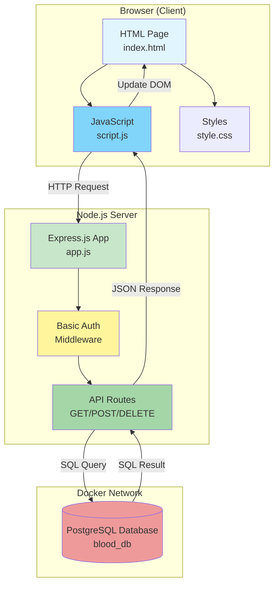
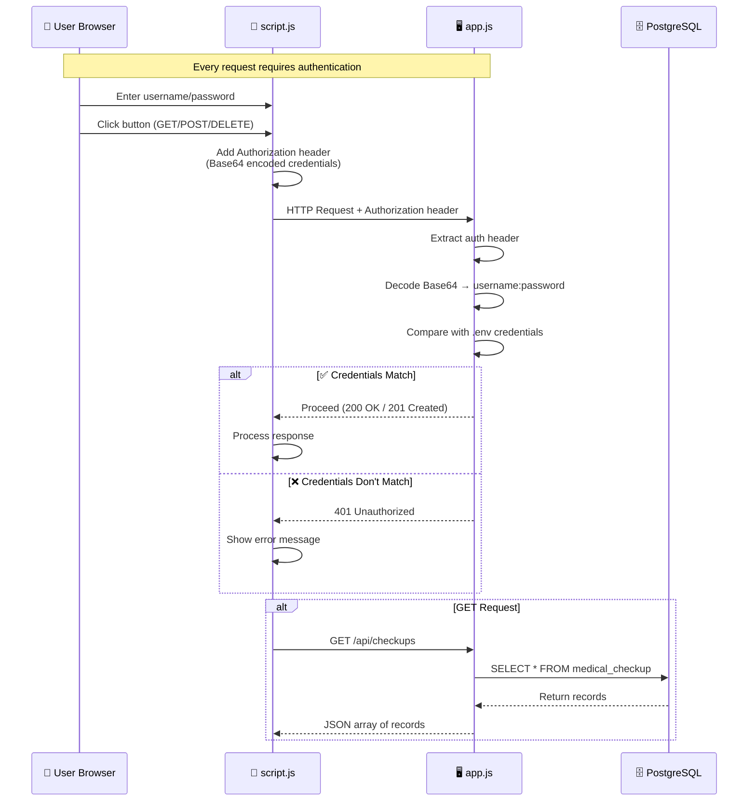
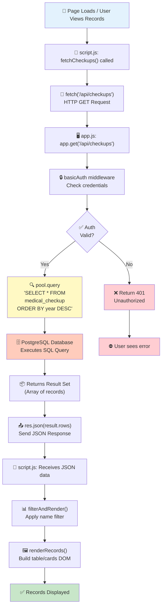
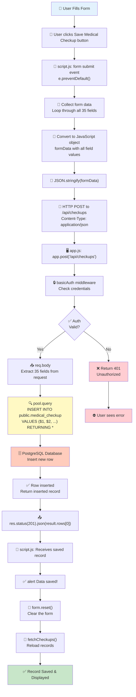
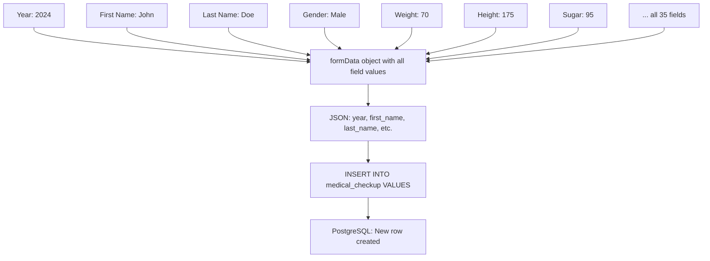
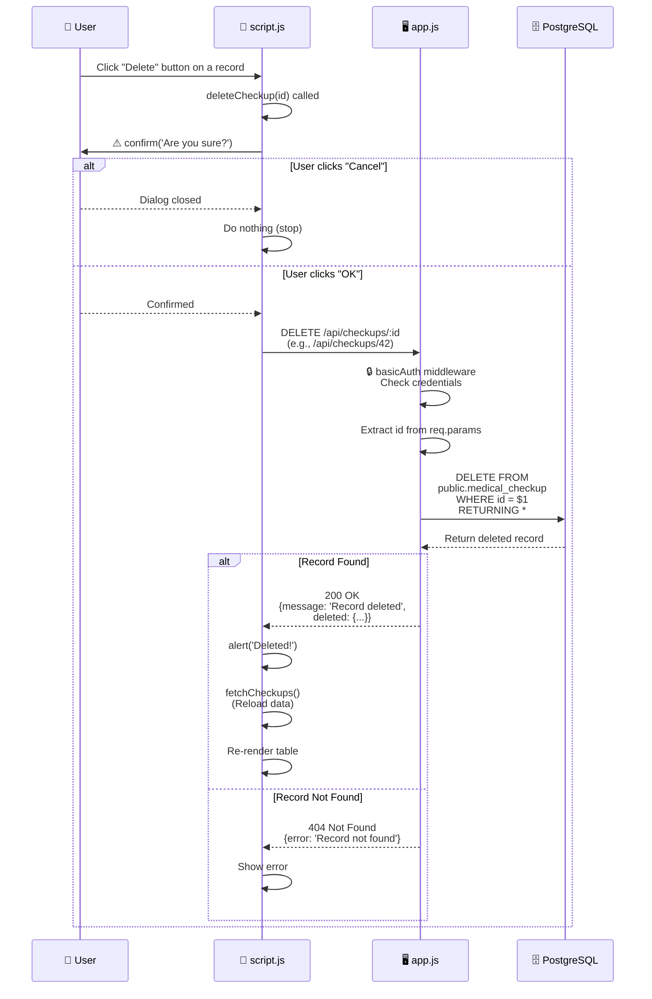
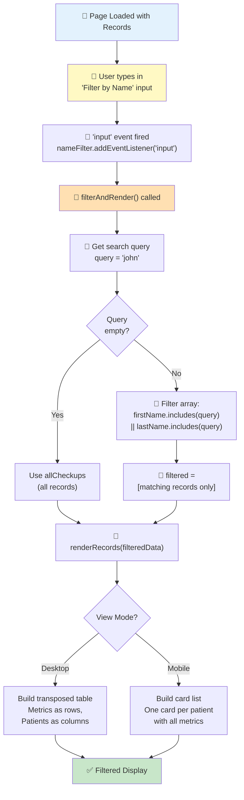
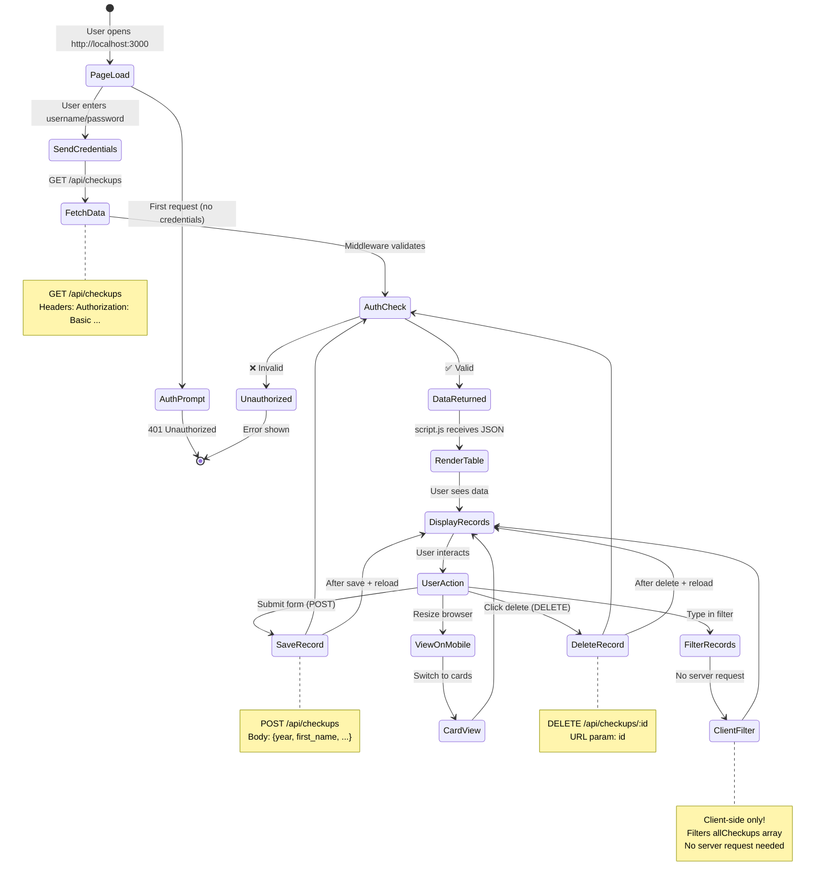
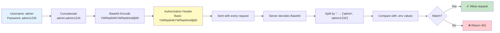

# 🔄 Medical Checkup Web Application — Workflow Diagrams

This document contains detailed Mermaid diagrams illustrating how the web application works, including all API scenarios (GET, POST, DELETE).

---

## 📋 Table of Contents

1. [Overall Architecture](#1-overall-architecture)
2. [Authentication Flow](#2-authentication-flow)
3. [GET Scenario — Fetch Medical Records](#3-get-scenario--fetch-medical-records)
4. [POST Scenario — Save New Medical Record](#4-post-scenario--save-new-medical-record)
5. [DELETE Scenario — Remove a Record](#5-delete-scenario--remove-a-record)
6. [Client-Side Filter Flow](#6-client-side-filter-flow)
7. [Complete Request/Response Cycle](#7-complete-requestresponse-cycle)

---

## 1. Overall Architecture



---

## 2. Authentication Flow



---

## 3. GET Scenario — Fetch Medical Records



### GET Flow — Detailed SQL

```mermaid
graph LR
    A["GET /api/checkups"] --> B["Express Router"]
    B --> C["Auth Middleware"]
    C --> D["pool.query<br/>SELECT * FROM<br/>public.medical_checkup<br/>ORDER BY year DESC,<br/>id DESC"]

    D --> E["PostgreSQL Engine"]
    E --> F["Scan table<br/>medical_checkup"]
    F --> G["Sort by year DESC<br/>then id DESC"]
    G --> H["Return all rows"]

    H --> I["Express: res.json()"]
    I --> J["JSON Array<br/>[{id, year, first_name,<br/>last_name, ...}]"]

    J --> K["Browser: allCheckups = data"]
    K --> L["renderRecords()"]

    style A fill:#e3f2fd
    style H fill:#c8e6c9
    style J fill:#fff9c4
    style L fill:#bbdefb
```



---

## 4. POST Scenario — Save New Medical Record



### POST — Data Structure



---

## 5. DELETE Scenario — Remove a Record



---

## 6. Client-Side Filter Flow



---

## 7. Complete Request/Response Cycle



---

## 📊 API Endpoints Summary

| Method | Endpoint | Auth Required | Request Body | Response | Description |
|--------|----------|:------------:|--------------|----------|-------------|
| `GET` | `/api/checkups` | ✅ Yes | None | `[{id, year, first_name, ...}]` | Fetch all records |
| `POST` | `/api/checkups` | ✅ Yes | `{year, first_name, last_name, ...}` (35 fields) | `{id, year, first_name, ...}` | Create new record |
| `DELETE` | `/api/checkups/:id` | ✅ Yes | None | `{message, deleted: {...}}` | Delete record by ID |

---

## 🔐 Authentication Details



---

## 🗄️ Database Schema Reference

```sql
CREATE TABLE public.medical_checkup (
    id            bigint NOT NULL,          -- Auto-increment primary key
    year          integer,                  -- Checkup year
    first_name    varchar(50),              -- Patient first name
    last_name     varchar(50),              -- Patient last name
    gender        varchar(15),              -- Male / Female / Other
    weight        double precision,         -- Weight in kg
    height        double precision,         -- Height in cm
    sugar         double precision,         -- Blood sugar (mg/dL)
    bun           double precision,         -- Blood Urea Nitrogen
    creatinine    double precision,         -- Kidney marker
    egrf          double precision,         -- Estimated GFR
    cholesterol   double precision,         -- Total cholesterol
    triglycerides double precision,         -- Triglycerides
    uric_acid     double precision,         -- Uric acid
    total_protein double precision,         -- Total protein
    albumin       double precision,         -- Albumin
    hdl_c         double precision,         -- HDL cholesterol
    ldl_c         double precision,         -- LDL cholesterol
    alk_phos      double precision,         -- Alkaline phosphatase
    sgot          double precision,         -- AST enzyme
    sgpt          double precision,         -- ALT enzyme
    hbs_ag        varchar(20),              -- Hepatitis B surface antigen
    wbc           double precision,         -- White blood cells
    rbc_m         double precision,         -- Red blood cells
    hgb_m         double precision,         -- Hemoglobin
    hct_m         double precision,         -- Hematocrit
    platelets     double precision,         -- Platelet count
    neu           double precision,         -- Neutrophils %
    lymp          double precision,         -- Lymphocytes %
    mono          double precision,         -- Monocytes %
    eos           double precision,         -- Eosinophils %
    baso          double precision,         -- Basophils %
    specific_gravity double precision,      -- Urine specific gravity
    ph            double precision,         -- Urine pH
    urine_exam    varchar(20),              -- Normal / Abnormal
    chest_x_ray   varchar(20)               -- Normal / Abnormal
);
```

---

## 🎨 Frontend Display Logic

```mermaid
graph TB
    Data["📦 JSON Data from API"] --> Parse["📄 Parse each record"]

    Parse --> BMI["⚖️ Calculate BMI<br/>weight / (height/100)²"]

    BMI --> Badge{"Generate Badge<br/>for each metric"}

    Badge --> TextFields["Text Fields<br/>(hbs_ag, urine_exam, chest_x_ray)<br/>'Normal'/'Negative' → 🟢 Green<br/>Other → 🔴 Red"]

    Badge --> Numeric["Numeric Fields<br/>Compare with reference range"]

    Numeric --> GenderRule{"Has gender-specific<br/>range?"}
    GenderRule -- Yes --> UseGender["Use range for<br/>record's gender"]
    GenderRule -- No --> UseDefault["Use default range"]

    UseGender --> Compare["Compare value with min/max"]
    UseDefault --> Compare

    Compare --> Result{"Value in range?"}
    Result -- Yes --> Green["🟢 Green badge<br/>Normal"]
    Result -- No < min --> Blue["🔵 Blue badge<br/>Low"]
    Result -- No > max --> Red["🔴 Red badge<br/>High"]

    Green --> Display["🖼️ Render Table/Cards"]
    Blue --> Display
    Red --> Display
    TextFields --> Display

    style Data fill:#e3f2fd
    style Display fill:#c8e6c9
    style Green fill:#c8e6c9
    style Blue fill:#bbdefb
    style Red fill:#ffcdd2